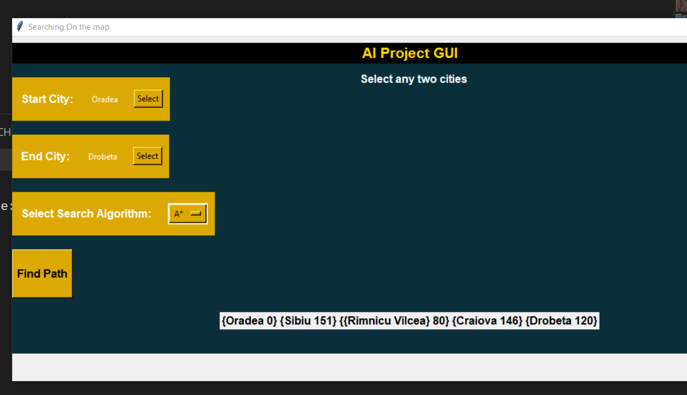

# City Path Finder

🌍✨ Python application for finding the shortest path between cities using various search algorithms.

## Description
This project is a Python application built using the Tkinter library that helps users find the shortest path between two cities on a map. It utilizes various search algorithms, including Depth-First Search (DFS), A* (A-star), Greedy Best-First Search (GBFS), and Breadth-First Search (BFS), to calculate the optimal path from the start city to the end city.

The application provides a graphical user interface (GUI) where users can input the start and end cities. The map is then displayed, and the application calculates and highlights the shortest path using the selected algorithm. This allows users to visualize and understand the path chosen by each algorithm.

## Features
🌟 User-friendly GUI for easy interaction.
🗺️ Map visualization with cities and connections.
🔍 Calculation of the shortest path between two cities.
🔢 Multiple search algorithms to choose from:
  - Depth-First Search (DFS)
  - A* (A-star)
  - Greedy Best-First Search (GBFS)
  - Breadth-First Search (BFS)

## Requirements
✔️ Python 3.7 or above
✔️ Tkinter library

## Installation
1. Clone the project repository to your local machine.
2. Ensure you have Python 3.7 or above installed.
3. Install the necessary dependencies by running the following command:
```shell
pip install tkinter
```
4. Once the dependencies are installed, navigate to the project directory.
5. Run the following command to start the application:
```shell
python main.py
```

## Usage
1. Launch the application by executing the `main.py` file.
2. Enter the start and end cities in the provided input fields.
3. Select the desired search algorithm from the available options (DFS, A*, GBFS, BFS).
4. Click the "Find Path" button to calculate and display the shortest path.
5. The map will be updated to highlight the chosen path between the start and end cities.

## Screenshots
📷 


## Contributing
Contributions to this project are welcome. If you find any issues or would like to propose improvements, please submit a pull request or open an issue on the project repository.

## Acknowledgments
- The project was inspired by the concepts of graph theory and search algorithms.
- Special thanks to the creators and contributors of the Tkinter library for providing the necessary tools to build the GUI.
